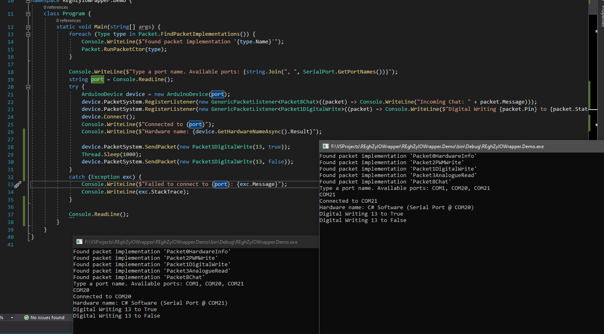
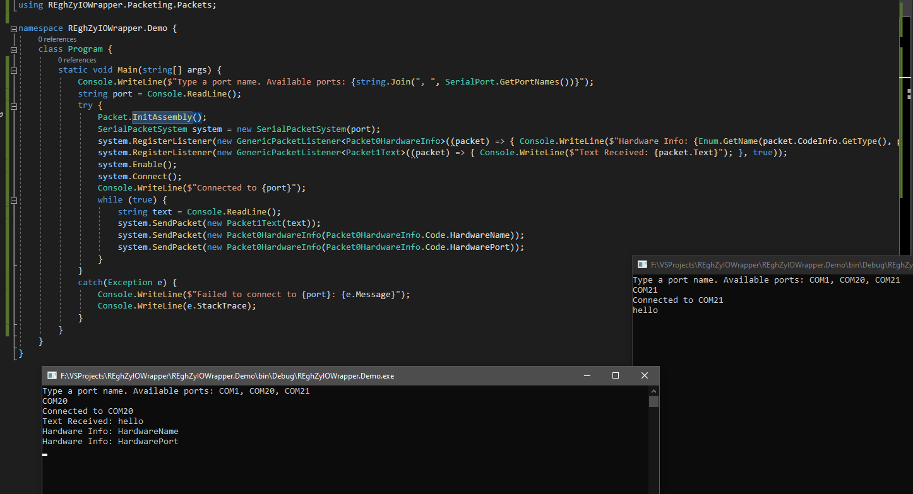

# REghZyIOWrapper
Flexible, packet based, communication. Only serial ports are supported. might use this for arduino communication

UPDATE: i made a faster, and also more efficient version of this: https://github.com/AngryCarrot789/REghZyIOWrapperV2

That new version writes the raw bytes of data (similar to minecraft's packeting system), rather than using formatted strings like this repo

heres a demo :)

pretty sure ive made like 3 of these projects but this one is the best. the other ones are a bit crud :( they didnt "feel" very good

heres the first version of the app :)

